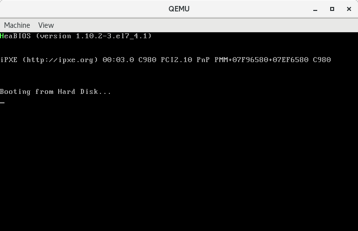
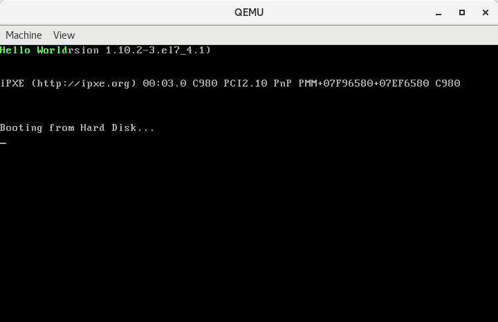

本文的目标是，构建一个引导扇区，并使用汇编语言，在屏幕上打印Hello World！。

经过学习，我们可以到一些基本的GNU汇编语言的用法，同时也会了解在屏幕上打印字符的原理。

<!--more-->

### 基础知识

要在屏幕上打印字符就需要对显存进行操作。那么如何操作显存呢？对于汇编语言来说，这个问题的答案是很简单的。如上一篇文章所讲，在计算机启动时，显卡被初始化为**文本模式**，对应的显存也已经映射到了`0xb8000`到`0xbffff`这段物理地址空间。所以直接向这段内存写入数据，屏幕上就能够打印出对应的字符了。

文本模式默认是80行、25列，可以显示2000个字符。在该模式下，每个字符的显示占据**两个字节**的空间，低字节保存字符的`ASCII`码，高字节保存字符的显示属性。

字符可以使用一个字节的数字来表示，那字符的显示属性又是如何表示的呢？

用于控制字符显示属性的字节中的每一位含义如下，其中`RGB`代表红绿蓝，`K`代表是否闪烁、`I`代表是否高亮。


例如：`0x0a`二进制为`00001010`，我们翻译翻译，就是黑色背景，不闪烁，绿色前景，高亮显示，高亮的效果是最终显示的是浅绿色。

有了上面的这些基础知识，那在屏幕上打印字符就非常简单了。具体来说，就是把字符的`ASCII`码和字符的属性依次送入显存对应的内存即可。


### 在屏幕上打印字符H

如下汇编代码，会在屏幕上打印一个字符H：
```asm
.code16

	movw	$0xb800, %ax
	movw	%ax, %es

	movb	$'H', %es:0
	movb	$0xa, %es:1

	jmp	.

	.org	510
	.word	0xaa55
```

* 第1行告诉编译器以16位模式编译，因为BIOS在加载并运行我们的代码时是处于16位实地址模式的。
* 第3、4行将附加数据段寄存器es的内容设置为0xb800。mov是数据转移指令，mov后面的w表示操作数的宽度为一个word，即16位的数据。movw $0xb800, %ax表示把立即数0xb800转移到寄存器ax中。其中0xb800是源操作数，ax是目的操作数。根据at&t的规范，立即数前需要加$符，用来和内存地址区分。寄存器前需要加%。这条指令执行完成之后ax寄存器的内容为0xb800，下一条指令又把ax寄存器中的数据转移到es中，完成段寄存器的设置。乍一看这不是多了块鱼吗？为啥不直接把0xb800放到es里？答案是段寄存器在程序运行中的职责比较重要，所以Intel没有提供直接把立即数转移到段寄存器的指令。通过强制多加一个步骤，可以使操作者明白自己到底在做什么，是否真的需要修改段寄存器的值。
* 第6行我们先来分析一下目的操作数%es:0，根据之前的内容我们知道这是以段基址:段内偏移的形式来给出内存地址。此时es的内容为0xb800，左移4位再加上偏移地址0，得到的物理地址为0xb8000。再来康康源操作数'H'，为啥这样写呢？得益于GNU as编译器的支持，我们能够以这种方式表示一个ASCII字符，编译器会帮我们把'H'转换为0x48。接下来康康mov后面的b，b表示byte，因为这次我们只操作一个字节的数据。
* 第7行和第6行基本一致，只不过偏移地址为1，最终的物理地址为0xb8001，0x0a表示浅绿色。
* 第9行是一条跳转指令，.单独使用时是一个特殊的符号，作为位置计数器，表示当前所在行的位置。那么这条指令就表示跳转到当前位置，实现的效果就是死循环。
* 第11、12行用了两条伪指令，伪指令是给编译器看的，并不是处理器最终会执行的指令。.org伪指令指示编译器把位置计数器移动到操作数所指定的位置，这里是将位置计数器移动到510处。.word伪指令指示编译器在当前位置写入一个字大小的数据，当然，操作数也可以用逗号隔开，表示写入一组一个字大小的数据。这里要写入的数据是0xAA55，何以是0xAA55？上次不是才说过第一个扇区的最后两个字节要是0x55、0xAA才能被引导吗？怎么反过来了？这是因为Intel处理器使用的是小端序，即数据的低字节存放在内存的低地址处，高字节存放在内存的高地址处。所以0xAA55在内存中仍然是按照0x55，0xAA的顺序存放的。

编译：

```
# as --32 boot.s -o boot.o
```

我们先看看boot.o的大小，它是不是符合我们512字节的要求
```
# ls -l boot.o
-rw-r--r-- 1 root root 956 Feb 23 16:47 boot.o
```

956字节，显然胖了。出现这种结果的原因是as生成的目标文件默认是elf格式的，elf格式的文件中除了二进制代码，还会附加一些头信息、段信息、链接信息、调试信息等等。对与我们这个程序来说，是用不到这些信息的，甚至连链接都不需要，直接把目标文件中的二进制代码复制出来就行了。这个操作我们使用objcopy这个工具来完成。


```
# objcopy -O binary -j .text boot.o boot.bin
```

* -O binary指定输出文件的格式为纯二进制格式，
* -j .text指定只复制.text段

输出的文件名为boot.bin。我们再来看看boot.bin文件的大小。
```
# ls -l boot.bin 
-rw-r--r-- 1 root root 512 Feb 23 16:48 boot.bin
```
刚刚好，512字节。再来看看其中的内容。

```
#  xxd -a boot.bin 
00000000: b800 b88e c026 c606 0000 4826 c606 0100  .....&....H&....
00000010: 0aeb fe00 0000 0000 0000 0000 0000 0000  ................
00000020: 0000 0000 0000 0000 0000 0000 0000 0000  ................
*
000001f0: 0000 0000 0000 0000 0000 0000 0000 55aa  ..............U.
```

启动一下：

```
$ qemu-system-i386 boot.bin
```



H字符打印出来，下一步我们来打印完整的Hello World。


### 在屏幕上打印字符串Hello World！

本节我们用循环的方式让计算机把所有的字符都打印出来。代码如下：

```asm
.code16

	movw	$0x07c0, %ax	
	movw	%ax, %ds

	movw	$0xb800, %ax
	movw	%ax, %es

	xorw	%si, %si
	movw	message_length, %cx

print:
	movb	message(%si), %bl
	movb	%bl, %es:(%si)
	incw	%si		
	loop	print

	jmp	.

message:
	.byte 'H', 0xa
	.byte 'e', 0xa
	.byte 'l', 0xa
	.byte 'l', 0xa
	.byte 'o', 0xa
	.byte ' ', 0xa
	.byte 'W', 0xa
	.byte 'o', 0xa
	.byte 'r', 0xa
	.byte 'l', 0xa
	.byte 'd', 0xa

message_length:
	.word	. - message

	.org	510
	.word	0xaa55
```

* 第3、4行用于将数据段寄存器ds的值设置为0x07c0，这是为了访问数据的方便。这里的数据指的是message和message_length这两个符号所处位置的数据。为什么是0x07c0呢？还记得我们在前面的文章中说的吗。BIOS会把我们的程序，也就是磁盘0柱面0磁道的第1个扇区加载到内存0x7c00处执行。因为ds是段寄存器，所以在寻址的时候左移4位，0x07c0转换为0x7c00。

* 第6, 7行，将es设置为显存映射的内存段，方便操控屏幕。

* 第9行使用异或指令xor将源索引寄存器si内容清空，即设置为0。可以把源索引寄存器想象成数组的下标，结合message标号处的数据，大概就能明白我们要做什么了吧？我们要通过这个索引来访问message标号开始处的数据，si每次增加1，依次，我们就能通过循环的方式访问所有的数据。

* 第10行将内存地址message_length处的数据转移到cx寄存器。我们先来分析一下message_length，message_length定义在第22行，后面跟了一个冒号，是一个标号(label)。标号代表的就是所处行的位置，这个在稍后我们反编译的时候可以看到。我们在这个位置定义了一个word的数据，数据的内容是message内容的长度。计算的方式是用当前位置（用位置计数器.表示）减去标号message所表示的位置，中间的这一段数据就是我们要打印的字符及其显示属性。cx是一个通用寄存器，但是通用寄存器也有特殊的用途。例如cx，在串操作指令和loop指令中作计数器用；在移位、循环移位指令中作移位次数计数器用。其中c就是count的意思。下面我们要用到loop指令来依次打印每一个字符，所以在这里设置cx。

* 第13行采用了寄存器相对寻址的方式将ds:(si + message)处的一个字节的数据转移到bx寄存器的低字节处bl。寻址方式我们稍后解释，这里先说明一下bl。8086中的4个16位数据寄存器ax、bx、cx、dx可以用来存放数据或地址，也可以将每个数据寄存器拆成两个独立的8位寄存器使用。高8位寄存器分别是ah、bh、ch、dh，低8位寄存器分别是al、bl、cl、dl。因为这里我们要移动一个字节的数据，所以拆了一个8位寄存器使用。

* 第14行采用了寄存器间接寻址的方式将bl中的一字节数据转移到内存es:si处，这里我们显示的指明了要使用es作为段地址，因为在使用si、di、bx做偏移量时默认使用的是ds段寄存器。我们用bl做了一个中转，把ds:(si + message)处的一个字节的数据转移到了es:si处。为什么需要用寄存器做一次中转呢？答案是8086处理器不支持同时操作两个内存数。

* 第15行使用了加一指令inc将si的值加一，相当于高级语言中常用的i++。

* 第16行使用了loop指令来实现循环。loop指令的功能是重复执行一段相同的代码，处理器在执行它的时候会顺序做两件事：1. 将寄存器cx的内容减一；2. 如果cx的内容不为零，转移到指定的位置处执行，否则顺序执行后面的指令。

* 第20行定义了标号message，标号实际上表示一个位置，它的一个功能就是方便我们引用数据。例如这里，如果我们手动去数'H'这个字符在内存中的第几个字节处，那这代码就没法写了，太痛苦了。但是当我们使用了标号时，编译器就会帮我们计算出'H'所在的位置，并在我们的代码中把使用了message的地方替换成实际的位置。

* 第21到31行依次定义了每一个要显示的字符，每个数据的长度为一字节(byte)，每个字符由两个字节组成，ASCII码和显示属性0xa（浅绿色）。

* 第33行定义了标号message_length，作为我们对要打印数据长度的引用。

* 第34行定义了要打印的数据的长度，占用一个字(word)的存储空间，值为当前位置减去标号message所表示的位置，结果即Hello World及其显示属性所占据的内存空间的大小。

编译并运行
```
# as --32 boot.s -o boot.o
# objcopy -O binary -j .text boot.o boot.bin
# qemu-system-i386 boot.bin
```
运行结果如下：




### 使用串操作指令打印Hello World!

含义：通过执行一条字符串操作指令，对存储器中某一个连续的内存中存放的一串字或字节均进行同样的操作，称为串操作。字符串操作指令简称为串操作指令。

所有的基本串操作指令都用寄存器si间接寻址源操作数，且假定源操作数在当前的数据段中，即源操作数首地址的物理地址由ds:si提供；而用寄存器di间接寻址目的操作数，且假定目的操作数在当前的附加段中，即目的操作数首地址的物理地址由es:di提供。显然，串操作指令的源操作数和目的操作数都在存储器中。

这两个地址的指针在每一个操作以后要自动修改，但按增量还是减量修改，取决于方向标志DF（位于标志寄存器内）：若DF=0，则在每次操作后si和di作增量操作：字节操作加1，字符操作加2；若DF=1，则在每次操作后si和di作减量操作：字节操作减1，字符操作减2。因此对于串操作，需要预先设置DF的值。可以用std或cld指令分别置DF为1或0。

若源串和目的串在同一段中，可使ds和es指向相同数据段，即ds=es。

还可以在任一串操作指令前加一个指令前缀，构成重复前级指令，通过此指令来控制串操作指令的重复执行操作。

下面结合代码来看一下如何通过串操作指令打印Hello World！

```asm
.code16

	movw	$0x07c0, %ax
	movw	%ax, %ds

	movw	$0xb800, %ax
	movw	%ax, %es


	cld			
	movw	$message, %si	
	xorw	%di, %di	
	movw	message_length, %cx	
	rep	movsb		

	jmp	.

message:
	.byte 'H', 0xa
	.byte 'e', 0xa
	.byte 'l', 0xa
	.byte 'l', 0xa
	.byte 'o', 0xa
	.byte ' ', 0xa
	.byte 'W', 0xa
	.byte 'o', 0xa
	.byte 'r', 0xa
	.byte 'l', 0xa
	.byte 'd', 0xa

message_length:
	.word	. - message	# 定义了标号message_length，作为我们对要打印数据长度的引用。

	.org	510
	.word	0xaa55
```

跟上一个打印hello World的代码不同之处主要在10到14行。

* 第10行，使用cld指令将DF标志位置为0，表示每次操作后对si和di做增量操作。

* 第11行，将message的地址赋值给si。此时引导扇区整体被BIOS加载到0x7c00处，并且我们已经将数据段设置成了0x07c0。message代表数据的偏移量，该指令执行后ds:si就指向了我们的数据首地址。

* 第12行，将di置0。此时es内容为0xb800，es:di表示的物理地址为0xb8000，即显存映射在内存中的首地址。

* 第13行，设置循环次数，循环的次数为数据串的长度。

* 第14行使用串传送指令movs来完成数据传送的工作。该指令具体分为两条movsb和movsw，分别为把由si作为指针的源操作数串中的一个字节或字，传送至由di作为指针的目的操作数串中，且根据DF修改各自的指针，使其指向各串中的下一单元。这里是把ds:si处的一个字节传送到es:di，并且把si和di分别加一。指令前缀rep是重复前缀，其功能是重复执行rep后紧跟着的一个串操作指令，直到cx寄存器中的值为0。执行时先检查cx的值，若为0则退出重复操作，执行以下其他指令；若不为0，则将cx的值减一；然后执行rep右侧的串指令；重复上述操作。

通过组合rep和movs我们就可以批量的把数据从内存的一个区域转移到另一个区域。

编译并运行
```
# as --32 boot.s -o boot.o
# objcopy -O binary -j .text boot.o boot.bin
# qemu-system-i386 boot.bin
```
运行结果如下：


### 总结

最后我们来对学到的知识点做一个总结：

* 8086 处理器采用分段的模型来操作内存，由 段基址:段内偏移 组合给出物理地址，计算方式为 段基址 左移 4 位，与 段内偏移 相加形成 20 位的物理地址。
* 计算机启动后，显卡默认初始化为 80 x 25 的文本模式，显存映射到内存的 0xb8000 到 0xbffff 这段物理地址空间。
文本模式下每个字符的显示由两个字节控制，低字节为该字符的 ASCII 码，高字节控制字符显示的颜色。
* .code16 告诉编译器将代码编译成符合 16 位处理器的格式。
* mov 指令用于转移数据。
* jmp 指令用于程序的跳转。
* . 位置计数器，表示当前位置，当然也可以通过给它赋值来改变当前位置。
* .org 伪指令，告诉编译器移动到操作数所指定的位置。
* .word 伪指令，用于写入一个字的数据，也可以写入多个一个字长的数据，用逗号分隔。
* 剩下的就是我们用到的那些工具as、objdump、objcopy，回过头去结合工具执行后的结果，理解理解每一个参数的含义就ok了。
* xor，异或指令，对源操作数和目的操作数做按位异或操作，结果保存在目的操作数中。
* inc，加一指令，对操作数加一。
* loop，循环指令，其功能是重复执行一段相同的代码，处理器在执行它的时候会顺序做两件事：
	* 将寄存器cx的内容减一。
	* 如果cx的内容不为零，转移到指定的位置处执行，否则顺序执行后面的指令。
* label，即标号，如l1、message、message_length。它们表示当前所处行的位置，当编译完成之后，会被替换成实际的位置。
* .byte，伪指令，用于定义一字节大小的数据，也可以同时指定一组一字节大小的数据，使用逗号分隔。
### 参考文档

* [汇编语言一发入魂-0x01-hello-world](https://kviccn.github.io/posts/2020/03/%E6%B1%87%E7%BC%96%E8%AF%AD%E8%A8%80%E4%B8%80%E5%8F%91%E5%85%A5%E9%AD%82-0x01-hello-world/)
* [汇编语言一发入魂-0x02-指令的寻址方式](https://kviccn.github.io/posts/2020/03/%E6%B1%87%E7%BC%96%E8%AF%AD%E8%A8%80%E4%B8%80%E5%8F%91%E5%85%A5%E9%AD%82-0x02-%E6%8C%87%E4%BB%A4%E7%9A%84%E5%AF%BB%E5%9D%80%E6%96%B9%E5%BC%8F/)
* [汇编语言一发入魂 0x03 - 更多的指令](https://kviccn.github.io/posts/2020/03/%E6%B1%87%E7%BC%96%E8%AF%AD%E8%A8%80%E4%B8%80%E5%8F%91%E5%85%A5%E9%AD%82-0x03-%E6%9B%B4%E5%A4%9A%E7%9A%84%E6%8C%87%E4%BB%A4/)
