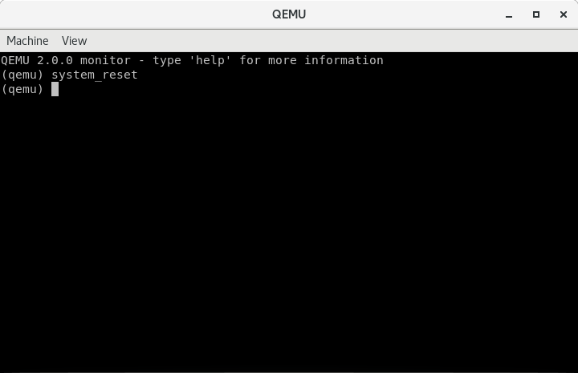

调试是软件开发过程中重要的一个环节，本文将详细介绍如何调试引导扇区。
其实第一节也涉及了部分调试命令。

<!--more-->

在操作系统的开发过程中我们通常使用QEMU虚拟机来运行我们开发的操作系统，使用GDB作为调试工具。GDB支持远程调试，这是通过一个简单的协议来实现的。QEMU支持该协议，所以我们可以配合这两者来完成我们的调试工作。


### 使用GDB进行调试

先编译生成引导扇区文件：
```
# as --32 boot.s -o boot.o
# objcopy -O binary -j .text boot.o boot.bin
```

通过如下命令启动虚拟机：
```
# qemu-system-i386 boot.bin -S -s
```

* `-S` : 参数告诉虚拟机启动后先不运行。
* `-s` : 参数告诉虚拟机开启一个GDB服务器等待客户端的连接，服务默认监听TCP端口1234。

启动`GDB`：
```
# gdb -q
(gdb) 
```

* `-q`: 参数表示静默启动，不显示版本信息。

连接到目标服务器：

```
(gdb) target remote localhost:1234
Remote debugging using localhost:1234
0x0000fff0 in ?? ()
(gdb)
```

设置CPU架构为i8086，因为最开始的这段代码运行在16位实地址模式：

```
(gdb) set architecture i8086
warning: A handler for the OS ABI "GNU/Linux" is not built into this configuration
of GDB.  Attempting to continue with the default i8086 settings.

The target architecture is assumed to be i8086
(gdb)
```
设置当程序停住或单步调试时自动显示指令

```
(gdb) display/i $cs*16+$pc
1: x/i $cs*16+$pc
   0xffff0:	ljmp   $0xf000,$0xe05b
(gdb) 
```


16位实地址模式下物理地址计算方式为段寄存器左移4位，即乘以十进制的16，再加上偏移地址。

因为BIOS会将引导扇区加载到0x7c00处开始执行，所以我们在这里打个断点：

```
(gdb) b *0x7c00
Breakpoint 1 at 0x7c00
(gdb) 
```


输入c使虚拟机恢复运行：


```
(gdb) c
Continuing.

Breakpoint 1, 0x00007c00 in ?? ()
1: x/i $cs*16+$pc
=> 0x7c00:	mov    $0x7c0,%ax
(gdb) 
```

观察第6行，正是我们的引导扇区的第一条指令。

查看寄存器内容：

```
(gdb) info registers
eax            0xaa55	43605
ecx            0x0	0
edx            0x80	128
ebx            0x0	0
esp            0x6ef4	0x6ef4
ebp            0x0	0x0
esi            0x0	0
edi            0x0	0
eip            0x7c00	0x7c00
eflags         0x202	[ IF ]
cs             0x0	0
ss             0x0	0
ds             0x0	0
es             0x0	0
fs             0x0	0
gs             0x0	0
(gdb) 
```
此时eax寄存器的内容为0xaa55。单步执行下一条指令再查看寄存器内容：

```
(gdb) si
0x00007c03 in ?? ()
1: x/i $cs*16+$pc
=> 0x7c03:	mov    %ax,%ds
(gdb) info registers
eax            0x7c0	1984
ecx            0x0	0
edx            0x80	128
ebx            0x0	0
esp            0x6ef4	0x6ef4
ebp            0x0	0x0
esi            0x0	0
edi            0x0	0
eip            0x7c03	0x7c03
eflags         0x202	[ IF ]
cs             0x0	0
ss             0x0	0
ds             0x0	0
es             0x0	0
fs             0x0	0
gs             0x0	0
```
此时eax寄存器的内容为0x7c0。继续调试：
```
(gdb) si
0x00007c05 in ?? ()
1: x/i $cs*16+$pc
=> 0x7c05:	mov    $0xb800,%ax
(gdb) info registers
eax            0x7c0	1984
ecx            0x0	0
edx            0x80	128
ebx            0x0	0
esp            0x6ef4	0x6ef4
ebp            0x0	0x0
esi            0x0	0
edi            0x0	0
eip            0x7c05	0x7c05
eflags         0x202	[ IF ]
cs             0x0	0
ss             0x0	0
ds             0x7c0	1984
es             0x0	0
fs             0x0	0
gs             0x0	0
```

此时数据段寄存器ds的内容已经是0x7c0了。再向后执行两条指令并查看寄存器内容：

```
(gdb) si 2
0x00007c0a in ?? ()
1: x/i $cs*16+$pc
=> 0x7c0a:	cld    
(gdb) info registers
eax            0xb800	47104
ecx            0x0	0
edx            0x80	128
ebx            0x0	0
esp            0x6ef4	0x6ef4
ebp            0x0	0x0
esi            0x0	0
edi            0x0	0
eip            0x7c0a	0x7c0a
eflags         0x202	[ IF ]
cs             0x0	0
ss             0x0	0
ds             0x7c0	1984
es             0xb800	47104
fs             0x0	0
gs             0x0	0
```

此时附加数据段寄存器es的内容为0xb800。

引导扇区调试的基本过程就是这样了。在调试过程中可能会需要重启虚拟机，如果重新手动执行qemu和gdb，再重新走一遍上面的流程多少是有点麻烦的。下面教大家两种直接重启虚拟机的方法。


### 直接重启虚拟机的方法

第一种方法：切换到QEMU窗口并按Ctrl-Alt-2以获取QEMU监视器，键入命令system_reset并使用Ctrl-Alt-1切换回去。如下所示：



第二种方法：跳转到BIOS重置指令的地址0xf000:0xfff0处。

```
(gdb) set $cs = 0xf000
(gdb) set $pc = 0xfff0
(gdb) c
Continuing.

Breakpoint 1, 0x00007c00 in ?? ()
1: x/i $cs*16+$pc
=> 0x7c00:      mov    $0x7c0,%ax
(gdb)
```

### 总结

本文中的命令摘要：
```
$ qemu-system-i386 boot.bin -S -s
(gdb) target remote localhost:1234
(gdb) set architecture i8086  # 16-bit mode
(gdb) display/i $cs*16+$pc    # show next instruction
(gdb) b *0x7c00               # breakpoint at boot sector
(gdb) set $cs = 0xf000
(gdb) set $pc = 0xfff0        # reboot
(gdb) c                       # continue execution
(gdb) si                      # step instruction
(gdb) x/5i $cs*16+$pc         # disassemble five instrs
(gdb) info registers          # show all registers
(qemu) system_reset
```
### 参考文章

