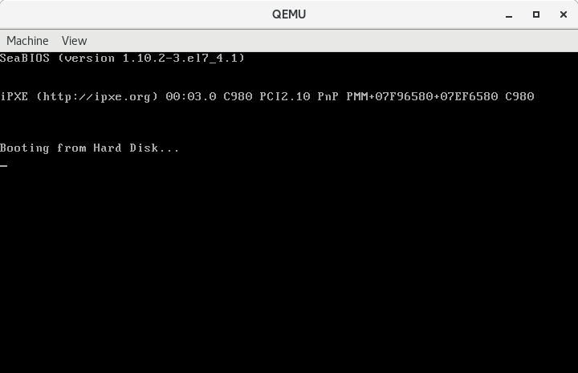
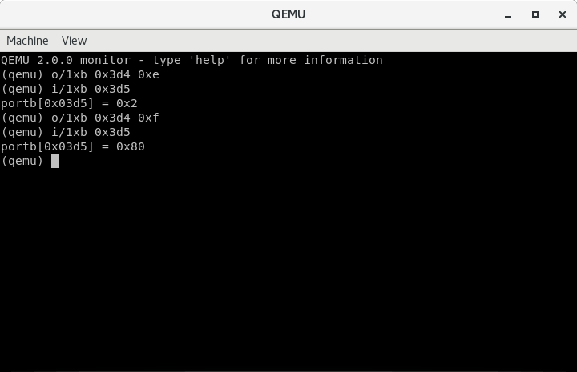
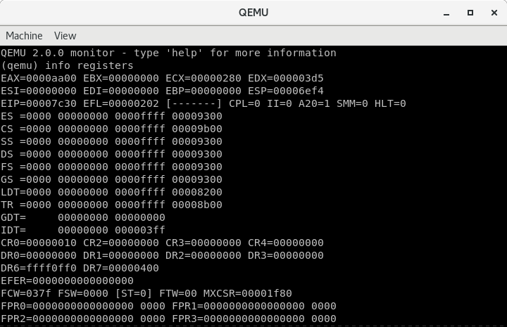

`I/O`接口用于`CPU`与外部`I/O`设备进行信息交换。例如与键盘、鼠标、打印机和显示等设备交互。`I/O`接口电路与总线系统看似很复杂，但是落实到汇编语言代码上实则是很简单的。下面简要介绍一下`I/O`接口技术。

<!--more-->

### I/O 接口技术

在计算机中，`CPU`与外设并不是直接相连的，在它们中间设有`I/O`接口电路。`CPU`通过数据总线、地址总线和控制总线与`I/O`接口电路相连，以实现与外设交换数据信息、状态信息和控制信息。外设的状态信息通过接口电路的状态端口经由数据总线进入`CPU`，而`CPU`向外设发出的控制信号也是经由数据总线，通过接口电路的控制端口来实现的。

#### I/O 端口

具体来说，`CPU`是通过`I/O`端口和外设交互的。`I/O`端口是接口电路中能被`CPU`直接访问的寄存器或存储器。通常，根据数据性质，`I/O`接口电路中可分为`3`种类型的端口，即`数据端口`、`状态端口`和`控制端口`。

1. 数据端口。用于存放`CPU`与外设之间交换的数据，数据的长度通常为`1~2`个字节。

2. 状态端口。用于指示外设的当前状态。每种状态用`1`位二进制数据表示，可由`CPU`通过数据总线和相关电路读取。状态端口的不同状态位的含义有：

    * 准备就绪位`(ready)`。对于输入端口，`ready=1`表示数据寄存器已准备好数据，等待`CPU`读取；当数据取走后，此位由`CPU`清零；对于输出端口，`ready=1`表示输出数据寄存器已空，可以接受下一个数据；当新数据到达后，该位由外设清零。

    * 忙位`(busy)`。`busy`表明外设是否能够接收数据。`busy=1`表示外设忙，暂时不允许`CPU`送数据过来。`busy=0`表示外设已空闲，允许`CPU`发送下一个数据。

    * 错误位`(error)`。`error=1`表示在数据传送过程中出现错误，`CPU`正在进行相应的处理，重新传送或中止操作等。

3. 控制端口。用于存放`CPU`向接口发出的各种命令、控制字和控制信号，以便控制外设的不同操作。

#### I/O 端口的寻址方式

`CPU`对端口的寻址方式通常有两种：

1. 存储器统一编址。又称为存储器映像编址，在这种编址方式中，`I/O`端口和内存单元统一编址，即把`I/O`端口当作内存单元对待，从整个内存空间中划出一个子空间给`I/O`端口，每一个`I/O`端口分配一个地址码，用访问存储器的指令对`I/O`端口进行操作。典型的例子是我们一直在使用的显存缓冲区，虽然我们使用的是操作内存的方式，但实际上操作的是显卡。
2. `I/O`独立编址。`I/O`端口编址和存储器的编址相互独立，即`I/O`端口地址空间和存储器地址空间分开设置，互不影响。采用这种编址方式，对`I/O`端口的操作使用输入/输出指令（`I/O`指令）。

#### I/O 端口地址分配

|  端口地址范围   | 分配说明  |
|  ----  | ----  |
| 0x000 --- 0x01F  | 8237A DMA控制器1 |
| 0x020 --- 0x03F  | 8259A可编程中断控制器1 |
| 0x040 --- 0x05F  | 8253/8254A 定时计数器 |
| 0x060 --- 0x06F  | 8042键盘控制器 |
| 0x070 --- 0x07F  | CMOS RAM/实时时钟RTC |
| 0x080 --- 0x09F  | DMA页面寄存器访问端口 |
| 0x0A0 --- 0x0BF  | 8259A可编程中断控制器2 |
| 0x0C0 --- 0x0DF  | 8237A DMA控制器2 |
| 0x0F0 --- 0x0FF  | 协处理器访问端口 |
| 0x170 --- 0x177  | IDE硬盘控制器1 |
| 0x1F0 --- 0x1F7  | IDE硬盘控制器0 |
| 0x278 --- 0x27F  | 并行打印机端口2 |
| 0x2F8 --- 0x2FF  | 串行控制器2 |
| 0x378 --- 0x37F  | 并行打印机端口1 |
| 0x3B0 --- 0x3BF  | 单色MDA显示控制器 |
| 0x3C0 --- 0x3CF  | 彩色CGA显示控制器 |
| 0x3D0 --- 0x3DF  | 彩色EGA/VGA显示控制器 |
| 0x3F0 --- 0x3F7  | 软盘控制器 |
| 0x3F8 --- 0x3FF  | 串行控制器1 |

### 实验：屏幕光标控制


这一小节给大家介绍一下关于屏幕光标的一些知识，并借助`QEMU`提供的访问`I/O`端口的能力在不写代码的情况下体验一下`I/O`端口的操作。


我们从控制屏幕光标来学习`I/O`端口的操作，因为控制屏幕光标很简单，只需要操作两个端口即可。

在之前的学习中，我们知道了计算机启动后显卡默认被初始化到`标准 VGA 文本模式`，该模式下屏幕总共可以显示`80 x 25 = 2000`个字符。从`0`开始计数，光标的范围在数值上为`0~1999`。光标在屏幕上的位置保存在显卡内部的两个光标寄存器中，每个寄存器都是`8`位的，合起来形成一个`16`位的数值。这两个寄存器在显卡内部的索引值分别是`14(0x0e)`和`15(0x0f)`，分别用于提供光标位置的高`8`位和低`8`位。在读写这两个寄存器之前需要先通过索引寄存器指定它们的索引，索引寄存器的端口号是`0x3d4`。指定了寄存器之后，就可以通过数据端口`0x3d5`来进行读写了。

下面就让我们通过`QEMU`来体验一下如何操作`I/O`端口。配合这个实验的主引导扇区代码如下：

```asm
# 告诉编译器以16位模式编译，因为BIOS在加载并运行我们的代码时是处于16位实地址模式的
.code16

	jmp	.

	# .org伪指令指示编译器把位置计数器移动到操作数所指定的位置，这里是将位置计数器移动到510处
	.org	510
	# .word伪指令指示编译器在当前位置写入一个字大小的数据
	.word	0xaa55
```

这段代码只有一个功能，就是陷入死循环。下面启动虚拟机：

```bash
$ as --32 boot.s -o boot.o
$ objcopy -O binary -j .text boot.o boot.bin
$ qemu-system-i386 boot.bin
```



可以看到光标的默认位置在`B`下方，我们通过端口将光标的实际位置取出来，看看和我们肉眼所见的位置一不一样。

通过`Ctrl-Alt-2`切换到`监视器`。

向索引寄存器的端口`0x3d4`写入`0xe`，因为我们接下来准备读取光标位置的高`8`位：
```bash
(qemu) o/1xb 0x3d4 0xe
```

这是`QEMU`提供的读写`I/O`端口的命令，并不是汇编指令，这一点不要搞混。

从数据端口`0x3d5`读取光标位置高`8`位：
```bash
(qemu) i/1xb 0x3d5
portb[0x03d5] = 0x2
```

结果是`0x2`。

再用同样的方式读取光标位置低`8`位：
```bash
(qemu) o/1xb 0x3d4 0xf
(qemu) i/1xb 0x3d5
portb[0x03d5] = 0x80
```

如图所示：



结果是`0x80`，将高`8`位与低`8`位组合在一起得到`0x280`，即十进制`640`，除以每行字符数`80`，得到`8`。即第`8`行，从`0`开始计。可能不太好数，我们来换个方式，把位置`0`写入到光标位置寄存器，看看光标会发生什么变化。

```bash
(qemu) o/1xb 0x3d4 0xe
(qemu) o/1xb 0x3d5 0
(qemu) o/1xb 0x3d4 0xf
(qemu) o/1xb 0x3d5 0
```

此时的结果如下：


可以看到光标已经在左上角的位置了。

*上面用到的`Qemu`命令的格式我并没有解释，`1xb`分别代表什么请查看[文档](https://www.qemu.org/docs/master/system/monitor.html)。*

### 用汇编代码控制屏幕光标位置

下面我们使用汇编语言完成和上面一样的功能，当程序运行完成后，光标的初始位置被保存在`cx`中。

代码如下：

```asm
# 告诉编译器以16位模式编译，因为BIOS在加载并运行我们的代码时是处于16位实地址模式的
.code16

# 将初始光标位置读入 cx
	movw $0x3d4, %dx
	movb $0xe, %al
	outb %al, %dx

	movw $0x3d5, %dx
	inb %dx, %al
	movb %al, %ch

	movw $0x3d4, %dx
	movb $0xf, %al
	outb %al, %dx

	movw $0x3d5, %dx
	inb %dx, %al
	movb %al, %cl

	# 设置光标位置为 0
	movw $0x3d4, %dx
	movb $0xe, %al
	outb %al, %dx

	movw $0x3d5, %dx
	movb $0, %al
	outb %al, %dx

	movw $0x3d4, %dx
	movb $0xf, %al
	outb %al, %dx

	movw $0x3d5, %dx
	movb $0, %al
	outb %al, %dx

	jmp	.

	# .org伪指令指示编译器把位置计数器移动到操作数所指定的位置，这里是将位置计数器移动到510处
	.org	510
	# .word伪指令指示编译器在当前位置写入一个字大小的数据
	.word	0xaa55
```

#### 解释

第`4~6`行使用`out`指令将`0xe`写入端口`0x3d4`，用于设置要访问的寄存器的索引。`out`指令的格式是固定的，源操作数必须是寄存器`al`或者`ax`，目的操作数可以是`8`位立即数或者寄存器`dx`。因为目标端口是一个`8`位端口，所以使用`al`寄存器；因为端口号`0x3d5`大于`0xff（8位立即数能表示的最大端口号）`，所以使用`dx`寄存器。

第`8、9`行从数据端口`0x3d5`读取数据到`al`。`in`指令的格式与`out`指令正好相反。

第`10`行将光标位置的高`8`位从`al`移动到`ch`，因为稍后还要使用`al`。

第`12~18`行用于读出光标位置的低`8`位并移动到`cl`中。此时`cx`中保存着光标完整的位置。

剩下的指令用于将光标位置的高`8`位和低`8`位分别置为`0`。

#### 运行

```bash
$ as --32 boot.s -o boot.o
$ objcopy -O binary -j .text boot.o boot.bin
$ qemu-system-i386 boot.bin
```

结果与上面一致，就不贴图了。


此时我们查看寄存器的值：



内容比较多，我们只关注`ecx`，值为`0x280`。与我们之前手动取出来的值是一致的。

### 参考文章

* [汇编语言一发入魂 0x05 - I/O接口技术](https://kviccn.github.io/posts/2020/03/%E6%B1%87%E7%BC%96%E8%AF%AD%E8%A8%80%E4%B8%80%E5%8F%91%E5%85%A5%E9%AD%82-0x05-i/o%E6%8E%A5%E5%8F%A3%E6%8A%80%E6%9C%AF/)
