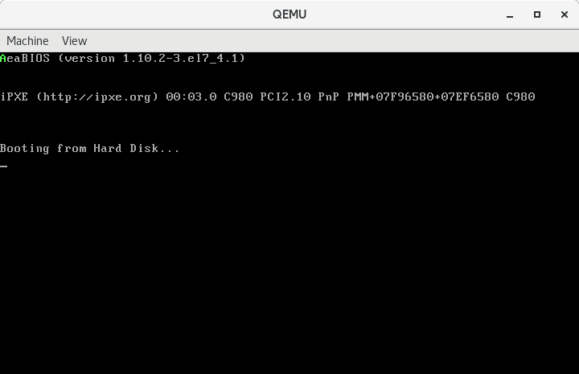

今天我们来学习如何从硬盘读取数据。主要从编程的角度来学习关于硬盘的知识，即学习如何通过端口控制硬盘。

<!--more-->

## 硬盘

从存储数据的介质上区分，硬盘可以分为**机械硬盘**和**固态硬盘**，机械硬盘采用磁性碟片来存储数据，固态硬盘通过闪存颗粒存储数据。从编程的角度看，固态硬盘是兼容机械硬盘的，所以我们以机械硬盘为例，简要介绍一下硬盘。

### 基础知识

机械硬盘主要由磁盘盘片、磁头、主轴与传动轴等组成，数据存放在磁盘盘片中。每个盘片分为上下两面，每面由一个磁头`(Head)`进行读写。磁头统一固定在同一个支架上，由步进电动机控制，同时在盘片的中心和边缘之间来回移动。当盘片高速旋转时，磁头每步进一次，都会从它所在的位置开始，绕着圆心“画”出一个看不见的圆圈，这就是磁道`(Track)`。磁道是数据记录的轨迹。因为所有磁头都是联动的，故每个盘面上的同一条磁道又可以形成一个虚拟的圆柱，称为柱面`(Cylinder)`。

每条磁道划分为若干扇区`(Sector)`，扇区是硬盘读写数据的最小单位。每个扇区以扇区头开始，然后是`512`字节的数据区。扇区头包含了每个扇区自己的信息，主要有本扇区的磁道号、磁头号和扇区号。

### 访问模式

硬盘读取数据的模式有两种：

1. `CHS`模式，即向硬盘控制器分别发送磁头号、柱面号和扇区号来访问。
2. `LBA`模式，通过对所有扇区统一编址，形成逻辑扇区，访问时提供逻辑扇区号即可。使用`LBA`模式不需要考虑扇区的物理位置，对于编程来说比较友好，下面我们来介绍`LBA`模式。

`LBA`模式又分为`LBA28`和`LBA48`两种。`LBA28`使用`28`个`bit`表示逻辑扇区号，每个扇区`512B`，总共可管理`128GB`的硬盘；`LBA48`使用`48`个`bit`表示逻辑扇区号，可管理`131072TB`的硬盘容量。。

在上一篇文章中，我们给出了部分`I/O`设备的端口地址分配，其中主硬盘接口分配的端口号是`0x1f0~0x1f7`，副硬盘接口分配的端口号是`0x170~0x177`。下面给出当使用`LBA28`方式访问硬盘时每个端口的用途。

- `0x1f0`，`16`位数据端口，用于读取或写入数据，每次读写`1`个字，循环直到读完所有数据。
- `0x1f1`，读取时的错误信息或写入时的额外参数。
- `0x1f2`，指定读取或写入的扇区数。
- `0x1f3`，`LBA`地址低`8`位。
- `0x1f4`，`LBA`地址中`8`位。
- `0x1f5`，`LBA`地址高`8`位。
- `0x1f6`，低`4`位保存`LBA`地址的前`4`位，高`4`位指定访问模式和访问的设备。其中第`4`位指示硬盘号，`0`表示主盘，`1`表示从盘；第`6`位指定访问模式，`0`表示`CHS 模式`，`1`表示`LBA 模式`。第`5、7`位为`1`。
- `0x1f7`，既是命令端口，又是状态端口。作为命令端口时，写入`0x20`表示请求读硬盘；写入`0x30`表示请求写硬盘。作为状态端口时，第`0`位为`1`表示前一个命令执行错误，具体原因可访问端口`0x1f1`；第`3`位为`1`表示硬盘已经准备好和主机进行数据交互；第`7`位为`1`表示硬盘忙。

## 实战

有了上面的知识我们就可以开始编码从硬盘读取数据了。我们打算创建一个`1KB`大小的虚拟硬盘，即`1024`字节大小。虚拟硬盘的大小其实并不影响我们的学习，能说明问题就可以了，小一点，理解起来可能会更容易。`1024`字节刚好可以分成两个逻辑扇区，逻辑扇区`0`和逻辑扇区`1`。逻辑扇区`0`作为主引导记录会被`BIOS`自动加载到内存，我们的目标就是将逻辑扇区`1`读入内存`0x10000`处。

### 代码

```asm
# 告诉编译器以16位模式编译，因为BIOS在加载并运行我们的代码时是处于16位实地址模式的
.code16


	# 用于设置es:di，将es设置为0x1000，di设置为0。指向物理地址的0x10000处，我们的数据将加载到这里
	movw	$0x1000, %ax
	movw	%ax, %es
	xorw	%di, %di

	# 向端口0x1f2写入1，表示要读取1个扇区。
	movw	$0x1f2, %dx
	movb	$1, %al
	outb	%al, %dx

	# 向端口0x1f3写入1，这是28位逻辑扇区号的0~7位。
	movw	$0x1f3, %dx
	movb	$1, %al
	outb	%al, %dx

	# 分别向端口0x1f4和0x1f5写入逻辑扇区号的中间8~15位和16~23位。
	movw	$0x1f4, %dx
	movb	$0, %al
	outb	%al, %dx

	movw	$0x1f5, %dx
	movb	$0, %al
	outb	%al, %dx

	# 向端口0x1f6写入0xe0，即二进制1110 0000。其中低4位是LBA编号的前4位，高4位1110表示以LBA 模式访问主硬盘。
	movw	$0x1f6, %dx
	movb	$0, %al
	orb	$0xe0, %al	# b'1110xxxx' LBA 主硬盘
	outb	%al, %dx

	# 向端口0x1f7写入命令0x20，表示读硬盘。
	movw	$0x1f7, %dx
	movb	$0x20, %al	# 读硬盘
	outb	%al, %dx

	# 不断的读取硬盘的状态并测试。andb $0x88, %al用于提取第7位和第3位，即硬盘是否忙，数据是否准备好。
	# cmpb $0x08, %al用于测试，如果相等则表明硬盘不忙且已经准备好数据，不相等则继续测试。
.wait:				# 等待硬盘不忙且准备好数据
	inb	%dx, %al
	andb	$0x88, %al
	cmpb	$0x08, %al
	jnz	.wait

	# 将计数寄存器cx设置为256。因为insw一次从端口读取2字节数据，一个扇区512字节，需要读取256次。
	movw	$256, %cx
	movw	$0x1f0, %dx	# 将dx设置为数据端口0x1f
	rep	insw		# 使用insw指令从端口读取数据，数据将会被读取到es:di指向的内存单元。配合rep前缀便可以实现批量操作。

	movw	$0xb800, %ax
	movw	%ax, %ds

	# 用于将物理地址0x10000处的数据打印在屏幕上。我们会在虚拟硬盘文件的逻辑扇区1开始处放置一个字符'A'，所以屏幕此时会打印出字符'A'。
	movw	%es:0, %ax
	movw	%ax, 0		# ???
	jmp	.

	# .org伪指令指示编译器把位置计数器移动到操作数所指定的位置，这里是将位置计数器移动到510处
	.org	510
	# .word伪指令指示编译器在当前位置写入一个字大小的数据
	.word	0xaa55
```

具体解释都在代码中。


### 编译并制作虚拟硬盘

1. 编译主引导扇区文件

```bash
# as --32 boot.s -o boot.o
# objcopy -O binary -j .text boot.o boot.bin
```

2. 创建数据文件

```bash
# echo 'A' >> message.data
```

使用`echo`命令创建一个文件，向其中写入字符`'A'`。因为`echo`的输出是以行为单位的，所以字符`'A'`后面还会跟一个换行符`'\n'`。而`'\n'`的`ASCII`编码正好是`0a`，即在数值上等于显示属性`黑底绿字，高亮显示`。

3. 将主引导扇区文件和数据文件合并成虚拟硬盘文件

```bash
# dd if=/dev/zero of=boot.img bs=512 count=2
# dd if=boot.bin of=boot.img conv=notrunc
# dd if=message.data of=boot.img seek=1 conv=notrunc
```

此时我们便得到了虚拟硬盘文件`boot.img`，查看一下内容：

```bash
# xxd -a boot.img 
00000000: b800 108e c031 ffba f201 b001 eeba f301  .....1..........
00000010: b001 eeba f401 b000 eeba f501 b000 eeba  ................
00000020: f601 b000 0ce0 eeba f701 b020 eeec 2488  ........... ..$.
00000030: 3c08 75f9 b900 01ba f001 f36d b800 b88e  <.u........m....
00000040: d826 a100 00a3 0000 ebfe 0000 0000 0000  .&..............
00000050: 0000 0000 0000 0000 0000 0000 0000 0000  ................
*
000001f0: 0000 0000 0000 0000 0000 0000 0000 55aa  ..............U.
00000200: 410a 0000 0000 0000 0000 0000 0000 0000  A...............
00000210: 0000 0000 0000 0000 0000 0000 0000 0000  ................
*
000003f0: 0000 0000 0000 0000 0000 0000 0000 0000  ................
```

其中前`512`字节是主引导扇区，以`0x55、0xaa`结束。第二个扇区开始处的两个字节为`0x41、0x0a`。

### 运行

```bash
# qemu-system-i386 boot.img
```

运行结果如下：



有兴趣的同学可以尝试将`message.data`中的`'A'`修改为别的字符，在不修改主引导扇区代码的情况下重新构建虚拟硬盘文件，运行并观察结果。

### 参考文章

* [汇编语言一发入魂 0x06 - 硬盘操作](https://kviccn.github.io/posts/2020/03/%E6%B1%87%E7%BC%96%E8%AF%AD%E8%A8%80%E4%B8%80%E5%8F%91%E5%85%A5%E9%AD%82-0x06-%E7%A1%AC%E7%9B%98%E6%93%8D%E4%BD%9C/)
