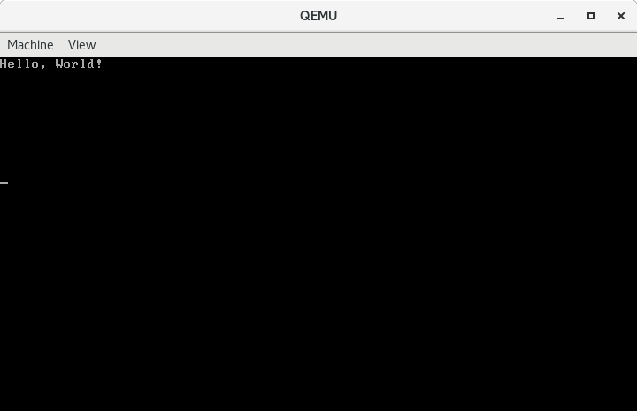

前面的文章几乎都在使用汇编语言，从本节开始，我们就逐步从`汇编语言`过渡到`C语言`。

<!--more-->

## 预处理

先来教大家一个技巧，在`汇编语言`中使用`预处理`。改造上一篇文章中的示例代码。
### 代码
```asm
# filename - boot.S
#include "mmu.h"

# 分别定义了两个符号，值分别为0x08，0x10
.set PROT_MODE_CSEG, 0x08	# code segment selector
.set PROT_MODE_DSEG, 0x10	# data segment selector

# 定义了一个全局可见的符号start
.global start

start:
	# 告诉编译器以16位模式编译，因为BIOS在加载并运行我们的代码时是处于16位实地址模式的
	.code16		# 用伪指令.code16告诉汇编器下面的代码按照16位的格式汇编

	cli		# 用于关闭中断，因为我们还没有设置如何处理保护模式下的中断

	# Enable A20
	inb	$0x92, %al
	orb	$0x2, %al
	outb	%al, $0x92


	# Load GDT
	lgdt	gdtdesc


	# Switch from real to protected mode
	movl	%cr0, %eax
	orl	$0x1, %eax
	movl	%eax, %cr0

	# Jump into 32-bit protected mode
	ljmp $PROT_MODE_CSEG, $protcseg		# 使用ljmp长跳转指令跳转到保护模式代码段中


	.code32
protcseg:
	movw	$PROT_MODE_DSEG, %ax
	movw	%ax, %ds

	movb	$'H', 0xb8000
	movb	$0x0a, 0xb8001

	movb	$'e', 0xb8002
	movb	$0x0a, 0xb8003

	movb	$'l', 0xb8004
	movb	$0x0a, 0xb8005

	movb	$'l', 0xb8006
	movb	$0x0a, 0xb8007

	movb	$'o', 0xb8008
	movb	$0x0a, 0xb8009

	movb	$',', 0xb800a
	movb	$0x0a, 0xb800b

	movb	$'W', 0xb800c
	movb	$0x0a, 0xb800d

	movb	$'o',0xb800e
	movb	$0x0a, 0xb800f

	movb	$'r', 0xb8010
	movb	$0x0a, 0xb8011

	movb	$'l', 0xb8012
	movb	$0x0a, 0xb8013

	movb	$'d', 0xb8014
	movb	$0x0a, 0xb8015

	movb	$'!', 0xb8016
	movb	$0x0a, 0xb8017

	hlt

.p2align 2
gdt:
	SEG_NULL
	SEG(STA_X | STA_R, 0x0, 0xffffffff)
	SEG(STA_W, 0x0, 0xffffffff)

# gdtdesc定义，其中低16位是GDT的长度减一，高32位是GDT的基地址。
gdtdesc:
	.word	gdtdesc-gdt -1
	.long	gdt

	# .org伪指令指示编译器把位置计数器移动到操作数所指定的位置，这里是将位置计数器移动到510处
	.org	510
	# .word伪指令指示编译器在当前位置写入一个字大小的数据
	.word	0xaa55
```

### 解释

第`1`行是注释，我们将文件保存为`boot.S`，注意，以大写`S`结尾。当`gcc`遇到大写`S`结尾的汇编语言源代码时将进行预处理。

第`2`行我们使用`include`引入外部文件`mmu.h`，我们在这个文件中做了一些宏定义，方面我们构造段描述符。

第`41~75`行有一些变化，内存单元的地址都加上了`0xb8000`，因为我们这次将数据段设置成了整个`4GB`的空间。

第`81~83`行我们使用了宏定义`SEG_NULL`，`SEG`。这两个宏定义在`mmu.h`中。先来看看它们是如何定义的。


### 代码

```c
/* filename - mmu.h */
#ifndef __MMU_H_
#define __MMU_H_

/*
 * Macros to build GDT entries in assembly.
 */

// 用于定义空描述符，可以看到64位全为0
#define SEG_NULL \
  .word 0, 0;    \
  .byte 0, 0, 0, 0

//接收段类型(type)、段基址(base)、段界限(lim)，经过位运算计算出段描述符。都是很简单的运算
#define SEG(type, base, lim)                      \
  .word(((lim) >> 12) & 0xffff), ((base)&0xffff); \
  .byte(((base) >> 16) & 0xff), (0x90 | (type)),  \
      (0xC0 | (((lim) >> 28) & 0xf)), (((base) >> 24) & 0xff)

// Application segment type bits
// 定义了数据段和代码段段类型中的每一位，通过组合这些位来构造段描述符的type位
#define STA_X 0x8 // Executable segment
#define STA_E 0x4 // Expand down (non-executable segments)
#define STA_C 0x4 // Conforming code segment (executable only)
#define STA_W 0x2 // Writeable (non-executable segments)
#define STA_R 0x2 // Readable (executable segments)
#define STA_A 0x1 // Accessed

#endif
```
### 解释

第`10~12`行用于定义空描述符，可以看到`64`位全为`0`。

第`15~18`行接收段类型`(type)`、段基址`(base)`、段界限`(lim)`，经过位运算计算出段描述符。都是很简单的运算，大家动手写一写，画一画就明白了。

第`22~27`行定义了数据段和代码段段类型中的每一位，通过组合这些位来构造段描述符的`type`位。

下面我们看一下预处理后的代码：
```bash
# cc -E  boot.S 
# 1 "boot.S"
# 1 "<built-in>"
# 1 "<command-line>"
# 1 "/usr/include/stdc-predef.h" 1 3 4
# 1 "<command-line>" 2
# 1 "boot.S"
# 1 "mmu.h" 1
# 2 "boot.S" 2

# 分别定义了两个符号，值分别为0x08，0x10
.set PROT_MODE_CSEG, 0x08 # code segment selector
.set PROT_MODE_DSEG, 0x10 # data segment selector

# 定义了一个全局可见的符号start
.global start

start:
 # 告诉编译器以16位模式编译，因为BIOS在加载并运行我们的代码时是处于16位实地址模式的
 .code16 # 用伪指令.code16告诉汇编器下面的代码按照16位的格式汇编

 cli # 用于关闭中断，因为我们还没有设置如何处理保护模式下的中断

 # Enable A20
 inb $0x92, %al
 orb $0x2, %al
 outb %al, $0x92


 # Load GDT
 lgdt gdtdesc


 # Switch from real to protected mode
 movl %cr0, %eax
 orl $0x1, %eax
 movl %eax, %cr0

 # Jump into 32-bit protected mode
 ljmp $PROT_MODE_CSEG, $protcseg # 使用ljmp长跳转指令跳转到保护模式代码段中


 .code32
protcseg:
 movw $PROT_MODE_DSEG, %ax
 movw %ax, %ds

 movb $'H', 0xb8000
 movb $0x0a, 0xb8001

 movb $'e', 0xb8002
 movb $0x0a, 0xb8003

 movb $'l', 0xb8004
 movb $0x0a, 0xb8005

 movb $'l', 0xb8006
 movb $0x0a, 0xb8007

 movb $'o', 0xb8008
 movb $0x0a, 0xb8009

 movb $',', 0xb800a
 movb $0x0a, 0xb800b

 movb $'W', 0xb800c
 movb $0x0a, 0xb800d

 movb $'o',0xb800e
 movb $0x0a, 0xb800f

 movb $'r', 0xb8010
 movb $0x0a, 0xb8011

 movb $'l', 0xb8012
 movb $0x0a, 0xb8013

 movb $'d', 0xb8014
 movb $0x0a, 0xb8015

 movb $'!', 0xb8016
 movb $0x0a, 0xb8017

 hlt

.p2align 2
gdt:
 .word 0, 0; .byte 0, 0, 0, 0
 .word(((0xffffffff) >> 12) & 0xffff), ((0x0)&0xffff); .byte(((0x0) >> 16) & 0xff), (0x90 | (0x8 | 0x2)), (0xC0 | (((0xffffffff) >> 28) & 0xf)), (((0x0) >> 24) & 0xff)
 .word(((0xffffffff) >> 12) & 0xffff), ((0x0)&0xffff); .byte(((0x0) >> 16) & 0xff), (0x90 | (0x2)), (0xC0 | (((0xffffffff) >> 28) & 0xf)), (((0x0) >> 24) & 0xff)

 # gdtdesc定义，其中低16位是GDT的长度减一，高32位是GDT的基地址。
gdtdesc:
 .word gdtdesc-gdt -1
 .long gdt

 # .org伪指令指示编译器把位置计数器移动到操作数所指定的位置，这里是将位置计数器移动到510处
 .org 510
 # .word伪指令指示编译器在当前位置写入一个字大小的数据
 .word 0xaa55
```

观察88-90行，宏定义已经被展开。

编译运行

```bash
# gcc -m32 -c boot.S -o boot.o
# ld -e start -Ttext=0x7c00 -m elf_i386 --oformat binary boot.o -o boot.bin
# qemu-system-i386 boot.bin
```
结果和之前相同，就不进行贴图了。

## 真正的使用 C 语言

继续改造我们的`boot.S`。

### 代码


```asm
#include "mmu.h"

# 分别定义了两个符号，值分别为0x08，0x10
.set PROT_MODE_CSEG, 0x08	# code segment selector
.set PROT_MODE_DSEG, 0x10	# data segment selector

# 定义了一个全局可见的符号start
.global start

start:
	# 告诉编译器以16位模式编译，因为BIOS在加载并运行我们的代码时是处于16位实地址模式的
	.code16		# 用伪指令.code16告诉汇编器下面的代码按照16位的格式汇编

	cli		# 用于关闭中断，因为我们还没有设置如何处理保护模式下的中断

	# Enable A20
	inb	$0x92, %al
	orb	$0x2, %al
	outb	%al, $0x92


	# Load GDT
	lgdt	gdtdesc


	# Switch from real to protected mode
	movl	%cr0, %eax
	orl	$0x1, %eax
	movl	%eax, %cr0

	# Jump into 32-bit protected mode
	ljmp $PROT_MODE_CSEG, $protcseg		# 使用ljmp长跳转指令跳转到保护模式代码段中


	.code32
protcseg:
	# 将ds, es, fs, gs, ss全部指向了4GB的数据段选择子
	movw	$PROT_MODE_DSEG, %ax 
	movw	%ax, %ds
	movw	%ax, %es
	movw	%ax, %fs
	movw	%ax, %gs
	movw	%ax, %ss

	# 设置堆栈指针esp指向start，这个标号在链接完成后对应的地址是0x7c00
	movl	$start, %esp

	# 调用我们定义的C 语言代码的入口点。
	call	bootmain

	jmp	.	# 死循环。

.p2align 2
gdt:
	SEG_NULL
	SEG(STA_X | STA_R, 0x0, 0xffffffff)
	SEG(STA_W, 0x0, 0xffffffff)

# gdtdesc定义，其中低16位是GDT的长度减一，高32位是GDT的基地址。
gdtdesc:
	.word	gdtdesc-gdt -1
	.long	gdt
```

### 解释

具体解释，已经注释到了代码中了。另外，代码的结尾，没有加可启动标志。这是为了方便链接，可启动标志将在链接完成之后手动加入。

下面给出`C 语言`部分的代码。

### 代码

```c
/* filename - main.c */

void printf(const char *message);

void bootmain(void)
{
	char *message = "Hello, World!";
	printf(message);

	while (1)
		;
}

void printf(const char *message)
{
	// 定义了一个unsigned short *类型的指针变量video_buffer，指向内存0xb8000处，即显存对应的内存处
	unsigned short *video_buffer = (unsigned short *)0xb8000;
	int i;

	// 清屏。因为一屏可以显示80 * 25个字符，每个字符占用两个字节
	// 将每一个字符处的显示属性取出(video_buffer[i] & 0xff00)，将低字节替换成' '，即实现了清屏。
	for (i = 0; i < 80 * 25; i++)
	{
		video_buffer[i] = (video_buffer[i] & 0xff00) | ' ';
	}

	// 实现打印字符串的功能。与清屏大致相同，只不过写入的字符由' '变成了参数提供的字符。
	for (i = 0; message[i] != '\0'; i++)
	{
		video_buffer[i] = (video_buffer[i] & 0xff00) | message[i];
	}
}

```

### 编译链接

代码本身并没有什么难懂的地方，只是在编译链接的时候需要一些技巧，才能让代码成功的运行起来。下面讲解编译链接的过程。
```bash
# gcc -m32 -c boot.S -o boot.o
# gcc -m32 -fno-builtin -fno-pic -nostdinc -c -o main.o main.c
# ld  -N -e start -Ttext=0x7c00 -m elf_i386  -o boot.elf  boot.o main.o
# objcopy -S -O binary -j .text -j .rodata boot.elf boot.bin
```
第`1`行，编译`boot.S`。这次使用`gcc`编译，因为要用到预处理。

第`2`行，编译`main.c`。注意三个选项即可。

- `-fno-builtin` 不接受不是两个下划线开头的内建函数。
- `-fno-pic` 禁止生成位置无关的代码。
- `-nostdinc` 不要在标准系统目录中寻找头文件。

第`3`行，将汇编语言编译的结果和 C 语言编译的结果链接起来。

- `-N` 不将数据对齐至页边界，不将`text`节只读。
- `-e` 设置起始地址。
- `-Ttext` 设置`.text`节的地址。
- `-m` 设置目标平台。

第`4`行，从`elf`格式的文件中复制出纯二进制的机器码。`elf`格式的文件并不能由处理器直接运行，所以我们要提取出其中的纯二进制机器码。

- `-S` 移除所有符号和重定位信息。
- `-O` 指定输出文件的格式。
- `-j` 指定从源文件中复制的*section*。这里指定了两个*section*`.text`和`.rodata`，因为有一部分数据在编译的时候被放在了`.rodata`中了，具体是哪些数据可以通过反编译查看，这里就不演示了。

此时我们的输出文件`boot.bin`中就包含了全部的汇编语言代码生成的指令和 C 语言代码生成的指令。

最后一步是为`boot.bin`加入可引导标记。
```bash
# ./sign boot.bin boot
```

通过之前介绍过的一个小工具[sign]()为`boot`添加可引导标志。

### 运行
```bash
# qemu-system-i386 boot
```

结果如下:




## 总结

简要总结一下。最开始我们学习了如何在`汇编语言`中使用`预处理`帮助我们简化`GDT`的构造，然后通过`汇编语言`准备好`32位保护模式`的环境，进入`32位保护模式`后我们通过`call`指令，将控制权转移到`C 语言`代码，完成交接。

完整的代码戳[这里]()。

## 参考资料
* [汇编语言一发入魂 0x0B - 拥抱 C 语言](https://kviccn.github.io/posts/2020/05/%E6%B1%87%E7%BC%96%E8%AF%AD%E8%A8%80%E4%B8%80%E5%8F%91%E5%85%A5%E9%AD%82-0x0b-%E6%8B%A5%E6%8A%B1-c-%E8%AF%AD%E8%A8%80/)
