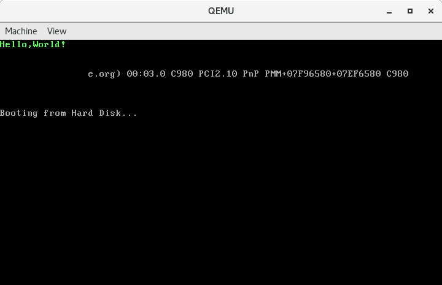
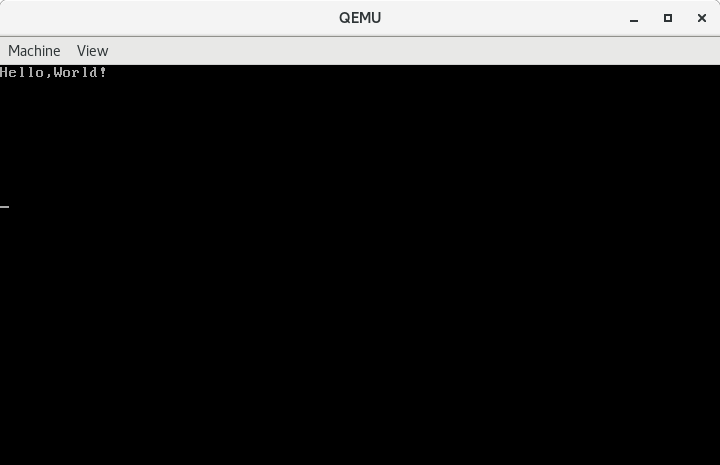

上篇文章，我们已经将控制权从`汇编语言`转移到`C 语言`，但是我们的活动范围依然受限于`512`字节的引导扇区。本文就来讨论一下突破这`512`字节的限制。
<!--more-->

## 读取硬盘数据

首先我们要学会读取硬盘的数据，因为大于512字节的信息是存储在硬盘上的，我们的bootloader需要从硬盘读取信息。

### 目标
我们会构造一个`1KB`大小的`磁盘映像文件`，第一个`扇区`，即前`512`字节，保存我们的引导扇区程序，第二个`扇区`，即后`512`字节，保存一个文本文件。通过引导扇区的程序将第二个扇区的文本文件打印在显示器上。

大体上来说完成这个目标需要两个步骤。第一步，将数据从磁盘读取到内存；第二步，将数据打印到显示器上。显然，第一步需要进行磁盘的 I/O 操作，第二步则相对简单。

### 目录结构

```bash
# tree
.
|-- boot.S
|-- main.c
|-- Makefile
|-- message.data
|-- mmu.h
|-- README.md
|-- sign.c
|-- types.h
`-- x86.h
```
其中`boot.S`、`mmu.h`内容与前一篇文章相同，不再重复介绍。完整的代码戳[这里]()


先来看`types.h`。
```c
#ifndef __TYPES_H_
#define __TYPES_H_

typedef signed char int8_t;
typedef unsigned char uint8_t;
typedef short int16_t;
typedef unsigned short uint16_t;
typedef int int32_t;
typedef unsigned int uint32_t;
typedef long long int64_t;
typedef unsigned long long uint64_t;

#endif
```

我们定义了一些`类型`，可以让我们少打几个字。

`x86.h`

```c
#include "types.h"

// inb函数内联了inb指令，用于从指定端口读取1字节数据。
static inline uint8_t
inb(uint16_t port)
{
  uint8_t data;
  asm volatile("inb %1,%0"
               : "=a"(data)
               : "d"(port));
  return data;
}

// outb函数内联了outb指令，用于向指定端口写入1字节数据。
static inline void
outb(uint16_t port, uint8_t data)
{
  asm volatile("outb %0,%1"
               :
               : "a"(data), "d"(port));
}

// insl函数内联了cld; rep insl指令，cld用于清除方向标志，使偏移量向正方向移动，这个偏移量其实就是传入的addr，会被关联到edi，反汇编的结果中可以看到，请大家自己实验。rep前缀用于重复执行insl，重复的次数由ecx决定，即传入的参数cnt。最终数据会被连续读取到addr指向的内存处。
static inline void
insl(int port, void *addr, int cnt)
{
  asm volatile("cld; rep insl"
               : "=D"(addr), "=c"(cnt)
               : "d"(port), "0"(addr), "1"(cnt)
               : "memory", "cc");
}
```
这里我们使用`内联汇编`定义了三个`函数`，这三个函数使用`static`、`inline`修饰。`static`保证函数只在声明它的文件中可见，避免和其他相同名称的函数冲突。`inline`告诉编译器尽可能将函数内联到调用它的地方，这样可以减少函数调用次数，提高效率，但这不是必然。

`inb`函数内联了`inb`指令，用于从指定端口读取`1字节`数据。

`outb`函数内联了`outb`指令，用于向指定端口写入`1字节`数据。

`insl`函数内联了`cld; rep insl`指令，`cld`用于清除方向标志，使`偏移量`向正方向移动，这个`偏移量`其实就是传入的`addr`，会被关联到`edi`，反汇编的结果中可以看到，请大家自己实验。`rep`前缀用于重复执行`insl`，重复的次数由`ecx`决定，即传入的参数`cnt`。最终数据会被连续读取到`addr`指向的内存处。

`main.c`

```c
#include "x86.h"

//声明函数readsect，用于从磁盘读取一个扇区。参数dst指定目的内存位置，参数offset指定要读取的扇区的偏移量。我们将使用LBA模式访问磁盘，该模式从0开始编号数据块，第一个区块LBA=0，第二个区块LBA=1，以此类推。
void readsect(void *dst, uint32_t offset);

void bootmain(void)
{
  // 调用readsect，将偏移量为1的扇区，即第二个扇区的数据读取到内存0xb8000处。因为我们将向该扇区写入ASCII编码的文本，所以可以直接将数据读取到显存对应的内存处，以直接打印文本。
  readsect((void *)0xb8000, 1);

  while (1)
    ;
}

// 定义函数waitdisk，采用忙等的方式等待磁盘准备好进行数据传输。
void waitdisk(void)
{
  while ((inb(0x1F7) & 0xC0) != 0x40)
    ;
}

// 定义函数readsect。
void readsect(void *dst, uint32_t offset)
{
  waitdisk();			// 调用waitdisk以确保磁盘准备好交互。

  outb(0x1F2, 1);		// 向端口0x1F2写入1，指定读取的扇区数量为1
  outb(0x1F3, offset);		// 向端口0x1F3、0x1F4、0x1F5、0x1F6写入28位的逻辑扇区编号，
				// 其中端口0x1F6的高四位写入0xE，表示以LBA模式访问主硬盘。
  outb(0x1F4, offset >> 8);
  outb(0x1F5, offset >> 16);
  outb(0x1F6, (offset >> 24) | 0xE0);
  outb(0x1F7, 0x20);		// 端口0x1F7做为命令端口，向其写入0x20表示请求读硬盘。

  waitdisk();			// 继续等待硬盘准备好数据。

  insl(0x1F0, dst, 512 / 4);	// 调用函数insl从端口0x1F0读取数据到dst，0x1F0是数据端口。
				// 读取的次数是512 / 4，因为一个扇区包含512个字节，而insl指令一次可以读取4个字节。
}
```

`message.data`

```
H
e
l
l
o
,
W
o
r
l
d
!
```
每一个字符换一行，因为换行符的`ASCII`码为`0a`，正好等于`浅绿色`的字符显示属性，所以我们可以直接将其与字符一起读入显存对应的内存处，做为字符的显示属性。既可以说是偷懒，也可以说是个小技巧。因为我们的目的是演示如何使用 C 语言读写磁盘。`message.data`的底层内容如下：

```bash
# xxd -a message.data 
00000000: 480a 650a 6c0a 6c0a 6f0a 2c0a 570a 6f0a  H.e.l.l.o.,.W.o.
00000010: 720a 6c0a 640a 210a                      r.l.d.!.
```

### 编译链接

```bash
# gcc -m32 -c boot.S -o boot.o
# gcc -m32 -fno-builtin -fno-pic -nostdinc -c -o main.o main.c
# ld  -N -e start -Ttext=0x7c00 -m elf_i386  -o boot.elf  boot.o main.o
# objcopy -S -O binary -j .text -j .rodata boot.elf boot.bin
# ./sign boot.bin boot
```
### 制作磁盘镜像

```bash
# dd if=/dev/zero of=boot.img bs=512 count=2
# dd if=boot of=boot.img conv=notrunc
# dd if=message.data of=boot.img seek=1 conv=notrunc
```
### 运行

```bash
# qemu-system-i386 boot.img
```
结果如下:



可以看到从`!`到`e`中间的部分是黑掉的。因为我们没有那么多数据，但是`readsect`还是会读取`512`个字节，而剩下的字节都是`0`。


## 加载内核

其实我们上一个例子的代码已经相当于一个`操作系统`的`bootloader`了。我们从磁盘读取了一段数据并显示在屏幕上，如果我们读取一段程序并执行它呢？

接下来，我们完成一个将`Hello World内核`加载到内存并运行起来的小例子。

### 目录结构

```bash
# tree
.
|-- boot.S
|-- kernel.c
|-- main.c
|-- Makefile
|-- mmu.h
|-- README.md
|-- sign.c
|-- types.h
`-- x86.h
```
还是挑有变化的来讲，除了`main.c`和`kernel.c`，其他内容都与之前相同。完整的代码戳[这里]()

`main.c`

```c
#include "x86.h"

//声明函数readsect，用于从磁盘读取一个扇区。参数dst指定目的内存位置，参数offset指定要读取的扇区的偏移量。我们将使用LBA模式访问磁盘，该模式从0开始编号数据块，第一个区块LBA=0，第二个区块LBA=1，以此类推。
void readsect(void *dst, uint32_t offset);

void bootmain(void)
{
  // 将数据读取到了内存0x10000处。
  readsect((void *)0x10000, 1);

  // 通过强制类型转换，将0x10000处开始的内容转换成了一个函数并调用，函数的类型是void (*)(void)
  ((void (*)(void))(0x10000))();

  while (1)
    ;
}

// 定义函数waitdisk，采用忙等的方式等待磁盘准备好进行数据传输。
void waitdisk(void)
{
  while ((inb(0x1F7) & 0xC0) != 0x40)
    ;
}

// 定义函数readsect。
void readsect(void *dst, uint32_t offset)
{
  waitdisk();			// 调用waitdisk以确保磁盘准备好交互。

  outb(0x1F2, 1);		// 向端口0x1F2写入1，指定读取的扇区数量为1
  outb(0x1F3, offset);		// 向端口0x1F3、0x1F4、0x1F5、0x1F6写入28位的逻辑扇区编号，
				// 其中端口0x1F6的高四位写入0xE，表示以LBA模式访问主硬盘。
  outb(0x1F4, offset >> 8);
  outb(0x1F5, offset >> 16);
  outb(0x1F6, (offset >> 24) | 0xE0);
  outb(0x1F7, 0x20);		// 端口0x1F7做为命令端口，向其写入0x20表示请求读硬盘。

  waitdisk();			// 继续等待硬盘准备好数据。

  insl(0x1F0, dst, 512 / 4);	// 调用函数insl从端口0x1F0读取数据到dst，0x1F0是数据端口。
				// 读取的次数是512 / 4，因为一个扇区包含512个字节，而insl指令一次可以读取4个字节。
}
```

`kernel.c`

```
#include "types.h"

void entry(void)
{
  uint16_t *video_buffer = (uint16_t *)0xb8000;
  int i;

  for (i = 0; i < 80 * 25; i++)
  {
    video_buffer[i] = (video_buffer[i] & 0xff00) | ' ';
  }

  video_buffer[0] = 0x0700 | 'H';
  video_buffer[1] = 0x0700 | 'e';
  video_buffer[2] = 0x0700 | 'l';
  video_buffer[3] = 0x0700 | 'l';
  video_buffer[4] = 0x0700 | 'o';
  video_buffer[5] = 0x0700 | ',';
  video_buffer[6] = 0x0700 | 'W';
  video_buffer[7] = 0x0700 | 'o';
  video_buffer[8] = 0x0700 | 'r';
  video_buffer[9] = 0x0700 | 'l';
  video_buffer[10] = 0x0700 | 'd';
  video_buffer[11] = 0x0700 | '!';
}
```

常规操作，清屏，打印字符，

### 编译链接
```bash
# gcc -m32 -c boot.S -o boot.o
# gcc -m32 -fno-builtin -fno-pic -nostdinc -c -o main.o main.c
# ld  -N -e start -Ttext=0x7c00 -m elf_i386  -o boot.elf  boot.o main.o
# objcopy -S -O binary -j .text -j .rodata boot.elf boot.bin
# ./sign boot.bin boot
```

### 制作 kernel

```bash
# gcc -m32 -fno-builtin -fno-pic -nostdinc -c -o kernel.o kernel.c
# objcopy -S -O binary -j .text kernel.o kernel
```
### 制作磁盘镜像

```bash
# dd if=/dev/zero of=boot.img bs=512 count=2
# dd if=boot of=boot.img conv=notrunc
# dd if=kernel of=boot.img seek=1 conv=notrunc
```
### 运行

```bash
# qemu-system-i386 boot.img
```
结果如下:



## 总结

先来说一下上面所谓的“内核”潜在的一些问题。我们只是简单的从磁盘读取了`512`字节的数据，事实上真正的“内核”的大小是变化的，可能小于`512`字节，但更多的可能是大于`512`字节。所以我们需要将“内核”的大小写在某个地方，让`bootloader`知道应该读取多少扇区。

下一篇文章将结合elf格式，读取磁盘上相应的内核镜像，然后将控制权交给内核。

## 参考文章

* [汇编语言一发入魂 0x0C - 解放生产力](https://kviccn.github.io/posts/2020/05/%E6%B1%87%E7%BC%96%E8%AF%AD%E8%A8%80%E4%B8%80%E5%8F%91%E5%85%A5%E9%AD%82-0x0c-%E8%A7%A3%E6%94%BE%E7%94%9F%E4%BA%A7%E5%8A%9B/)
