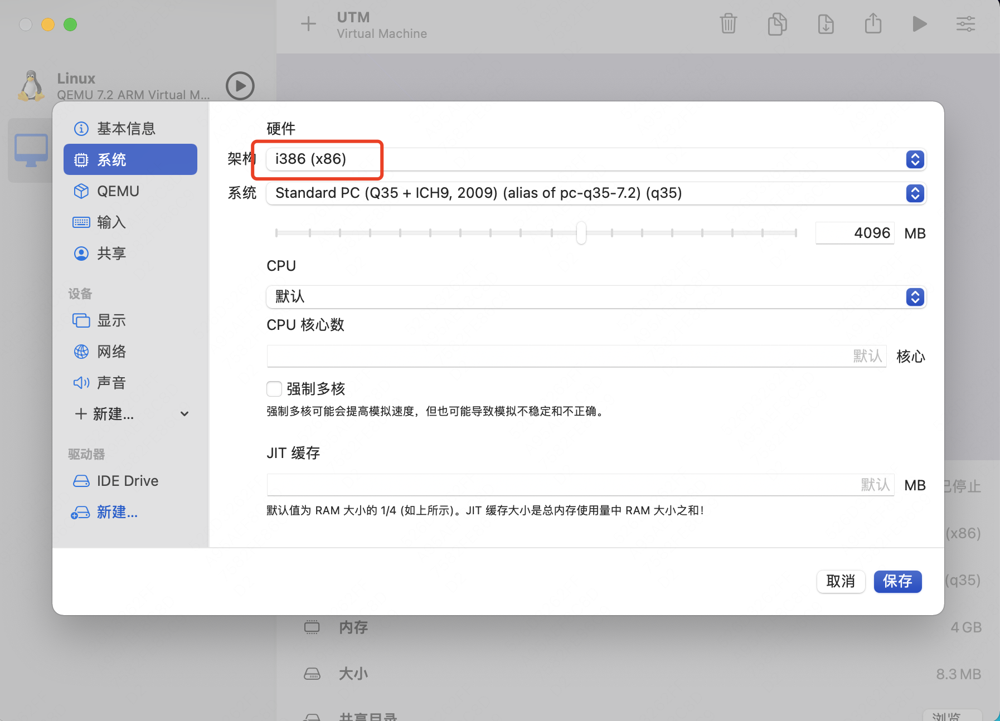
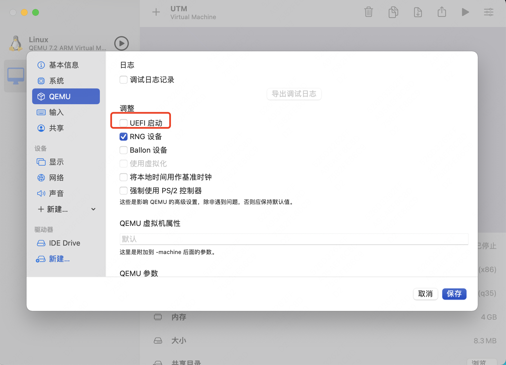
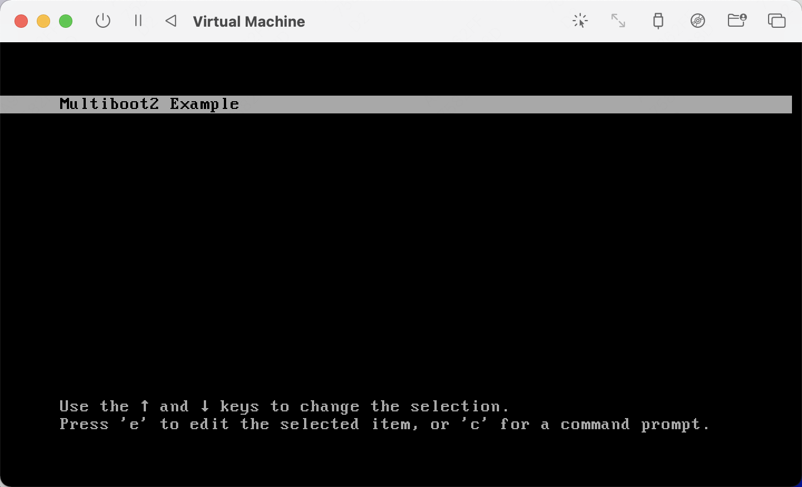
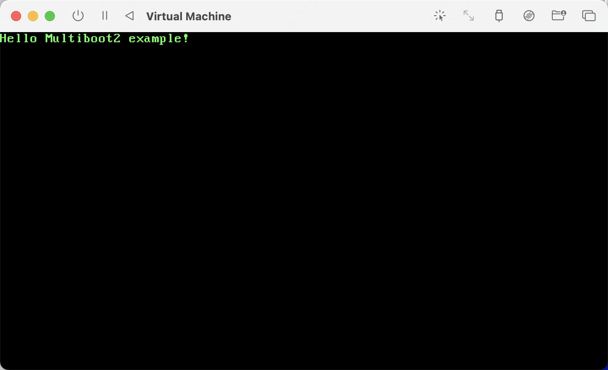
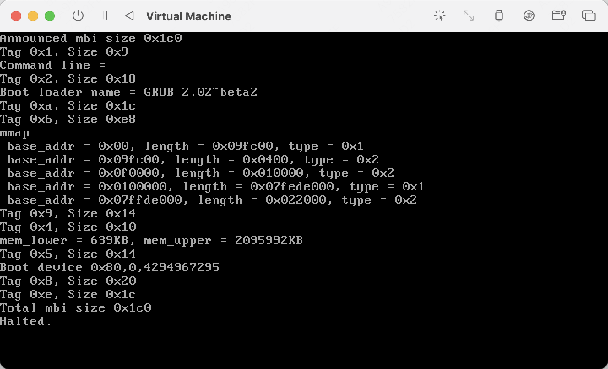

前面从引导程序一步一步完成了整个`PC`的启动过程，本节我们可以借用`GRUB`引导程序，来引导我们自己的内核。这可以大大简化我们内核的引导工作。

<!--more-->

### 什么是Multiboot2规范
每个操作系统都倾向于构建自己的启动加载器，在一个机器上安装一个新的操作系统，通常涉及安装一套新的启动机制。在一个机器上安装多个操作系统，并使他们能够沟通，就需要想办法在一个操作系统的启动加载器中能够加载另外一个操作系统，这将使得操作系统的启动器部分开发变得非常复杂。

对于开源操作系统来说，解决这个问题不不难，`Multiboot2`规范应运而生，它描述了一个启动载入器与一个操作系统之间的接口，这样，任何遵循该规范的启动载入器，都应该能够载入任何遵循改规范的操作系统。这个规范不规定启动载入器应该如何工作，仅规定它们与要载入的操作系统直接的接口。

### Multiboot2规范核心点

一个启动加载器和操作系统镜像的接口主要包括如下三个方面：

* 启动加载器看到的操作系统镜像的格式。
* 启动加载器启动机器后，计算机的状态。
* 启动加载器启动后，传递给操作系统的启动信息的格式。


#### 操作系统镜像格式

一个`OS`映像，除了该`OS`映像所使用文件格式的头部外，必须包含一个称为`Multiboot2 header`的额外的头部。`Multiboot2 header`必须被完整包含在OS映像的前32768字节内，而必须与长字（64位）对齐。一般而言，它应该尽早出现，比如可以嵌入到可执行文件头部之后，代码段的之前。

`Multiboot2 header`的格式如下：

```
Offset	Type	Field Name	Note
0	u32	magic		required
4	u32	architecture	required
8	u32	header_length	required
12	u32	checksum	required
16-XX		tags		required
```

* `magic `: 标识`Multiboot2 header`的魔数，它必须是十六进制数`0xE85250D6`。
* `architecture `:表示处理器类型，0代表32位保护模式的i386，4代表32-bit MIPS。
* `header_length`:表示`Multiboot2 header`的整体长度
* `checksum`:是一个32位无符号整数，其和`magic `、`architecture `、`header_length`的值相加之和必须为0。
* `tags `: 包含多个tag。

`tags`的一般格式如下：

```
        +-------------------+
u16     | type              |
u16     | flags             |
u32     | size              |
        +-------------------+
```

注意：
* 每个`tag`开始位置都要`64`位对齐（`8-bytes aligned`）
* 最后一个`tag`的`type`必须为`0`，`size`必须为`8`

关于详细的操作系统镜像格式，可以参考：[OS-image-format](https://www.gnu.org/software/grub/manual/multiboot2/multiboot.html#OS-image-format)

#### 计算机的状态

这里只介绍一下启动加载器调用32位操作系统时，`I386`计算机的状态：

* `EAX`：必须包含魔数`0x36d76289`，表明该操作系统是被一个支持`Multiboot2`规范的引导器启动的。

* `EBX`: 必须包含由启动加载器提供的，`Multiboot`信息结构的32位物理地址。
* `CS`: 必须是一个偏移为`0`，限长为`0xFFFFFFFF`的`32`位读/执行代码段。具体值没有定义。
* `DS`、 `ES`、 `FS`、 `GS`、 `SS`: 必须是一个偏移为`0`，限长为`0xFFFFFFFF`的`32`位读/写数据段。具体值没有定义。
* `A20 gate`: 必须激活
* `CR0`: 第31位（PG）必须被清除。第0位（PE）必须被设置。其它位未定义。
* `EFLAGS`:第17位（VM）必须被清除。第9位（IF）必须被清除。其它位未定义。

所有其它处理器寄存器及标记位都未定义。这包括，特别是：
* `ESP`:一旦需要，OS映像必须构建自己的栈。
* `GDTR`：即便段寄存器如上所示那样设置，`GDTR`可能是无效的，因此`OS`映像必须不加载任何段寄存器，直到它设立自己的`GDT`。
* `IDTR`:OS映像必须保持禁止中断，直到它设立自己的IDT。

详细的`I386`计算机状态，可以参考：[I386-machine-state](https://www.gnu.org/software/grub/manual/multiboot2/multiboot.html#I386-machine-state)

#### 传递给操作系统的启动信息格式

一旦启动加载启动后，`EBS`寄存器保存了传递给操作系统启动信息的物理地址。操作系统可以使用或者忽略这些信息，所有传递给操作系统的启动信息都是仅供参考的。

传递给操作系统的启动信息可以由启动加载器放在内存的任何位置，一般由操作系统来保证这些信息在使用之前不会被覆盖。

启动信息由一个固定的部分和一些列`tag`组成，并且是`64`位对齐的。固定部分格式如下：
```
        +-------------------+
u32     | total_size        |
u32     | reserved          |
        +-------------------+
```

* `total_size` contains the total size of boot information including this field and terminating tag in bytes

* `reserved` is always set to zero and must be ignored by OS image

固定部分之后是一系列`tag`，每个`tag`以如下格式开始：
```
        +-------------------+
u32     | type              |
u32     | size              |
        +-------------------+
```

详细的启动信息格式，可以参考：[Boot-information-format](https://www.gnu.org/software/grub/manual/multiboot2/multiboot.html#Boot-information-format)


### 使用grub2来启动符合Multiboot2规范的内核

#### OS镜像准备
有了上面的知识后，我们就可以构造一个支持`Multiboot2`规范的操作系统镜像。该镜像非常简单，主要实现在`boot.S`文件总，代码如下：
```asm
/*  The magic field should contain this. */
#define MULTIBOOT2_HEADER_MAGIC                 0xe85250d6
/*  The size of our stack (16KB). */
#define STACK_SIZE                      0x4000

	.text
        .globl  start, _start
start:
_start:
        jmp     multiboot_entry

        /*  Align 64 bits boundary. */
        .align  8
        
        /*  Multiboot header. */
multiboot_header:
        /*  magic */
        .long  MULTIBOOT2_HEADER_MAGIC 
        /*  ISA: i386 */
        .long  0 
        /*  Header length. */
        .long   multiboot_header_end - multiboot_header
        /*  checksum */
        .long   -(MULTIBOOT2_HEADER_MAGIC+ 0 + (multiboot_header_end - multiboot_header))
        /*  Align 64 bits boundary. */
        .align  8
#ifndef __ELF__
address_tag_start:      
        .short 2 
        .short 1 
        .long address_tag_end - address_tag_start
        /*  header_addr */
        .long   multiboot_header
        /*  load_addr */
        .long   _start
        /*  load_end_addr */
        .long   _edata
        /*  bss_end_addr */
        .long   _end
address_tag_end:
#endif /*  __ELF__ */
        /*  Align 64 bits boundary. */
        .align  8
entry_address_tag_start:        
        .short 3 
        .short 1 
        .long entry_address_tag_end - entry_address_tag_start
        /*  entry_addr */
        .long multiboot_entry
entry_address_tag_end:
        /*  Align 64 bits boundary. */
        .align  8
        .short 0 
        .short 0
        .long 8
multiboot_header_end:
multiboot_entry:
        /*  Initialize the stack pointer. */
        movl    $(stack + STACK_SIZE), %esp

        /*  Reset EFLAGS. */
        pushl   $0
        popf

        /*  Now enter the C main function... */
        call    main

loop:   hlt
        jmp     loop

        /*  Our stack area. */
        .comm   stack, STACK_SIZE
```

* 第`2`行和第`4`行分别定义了宏`MULTIBOOT2_HEADER_MAGIC`和`STACK_SIZE`。
* 第`16`行到`56`行实现了`Multiboot2 header`，总共有三个`tag`（包括最后一个结尾`tag`）
* 第`57`行是代码的入口`multiboot_entry`，这里准备了栈信息，方便后面调用c函数
* 第`66`行调用了`main`函数
* 第`68-69`行，程序进入死循环，一直等待。


`main`函数的实现如下：
```c
void _strwrite(char* string)
{
    char* p_strdst = (char*)(0xb8000);
    while (*string)
    {

        *p_strdst = *string++;
	p_strdst += 1;
	*p_strdst = 0xa;
        p_strdst += 1;
    }
    return;
}

void printf(char* fmt, ...)
{
    _strwrite(fmt);
    return;
}
void main()
{
    printf("Hello Multiboot2 example!");
    return;
}
```
* 第`1-19`行实现了`printf`函数，该函数在`main`中会用到。默认情况下，打印出的字符颜色是绿色的，这个设置在第`9`行中实现。
* 注意：这里的打印实现是直接写`0xb8000`这个物理地址。因为在计算机启动时，显卡被初始化为文本模式，对应的显存也已经映射到了`0xb8000`到`0xbffff`这段物理地址空间。所以直接向这段内存写入数据，屏幕上就能够打印出对应的字符了。
* 第`20`行的`main`函数只是调用了上面实现的`printf`函数，打印了字符串`Hello Multiboot2 example!`

当然，编译上述代码，需要的`Makefile`如下：

```
CC = cc
CFLAGS = -m32 -fno-stack-protector -I.
KERNEL_NAME = kernel
LDFLAGS = -Ttext 0x100000 -melf_i386 -nostdlib -nostartfiles
all: $(KERNEL_NAME)

$(KERNEL_NAME): boot.o main.o
	$(LD) $(LDFLAGS) $^ -o kernel

boot.o: boot.S
	$(CC) -c $(CFLAGS) $< -o $@

clean:
	rm -f *.o kernel
```

直接执行`make`命令，就可以编译成功，最终`OS镜像`名称为`kernel`。

#### 使用grub2来启动 {#section-grub2}

我们有了符合`Multiboot2`规范的操作系统镜像后，就需要一个支持`Multiboot2`规范的启动引导器来引导我们的镜像，幸运的是，`grub2`这个比较常用的引导器是支持`Multiboot2`规范的。下面我们就使用该`grub2`来引导我们自己的`OS`镜像。步骤如下：

1、首先我们要创建启动盘：

```bash
[root@localhost ]#  dd if=/dev/zero of=hd.img bs=512 count=131072
131072+0 records in
131072+0 records out
67108864 bytes (67 MB) copied, 0.234116 s, 287 MB/s
```

2、使用`parted`在磁盘上建立引导分区
```bash
[root@localhost ]#  parted hd.img 'mklabel msdos mkpart primary fat16 1MB -1 set 1 boot on'
```
执行完后，可以查看磁盘信息：
```bash
[root@localhost ]# parted hd.img
GNU Parted 3.1
Using /root/using-multiboot2-example/hd.img
Welcome to GNU Parted! Type 'help' to view a list of commands.
(parted) print                                                            
Model:  (file)
Disk /root/using-multiboot2-example/hd.img: 67.1MB
Sector size (logical/physical): 512B/512B
Partition Table: msdos
Disk Flags: 

Number  Start   End     Size    Type     File system  Flags
 1      1049kB  66.1MB  65.0MB  primary               boot, lba

(parted) quit   
```
3、 使用`losetup`将磁盘镜像文件虚拟成块设备：
```bash                                                   
[root@localhost ]#  losetup --show -P -f hd.img 
/dev/loop10
[root@localhost ]# ls /dev/loop10*
/dev/loop10  /dev/loop10p1
```
可以看到，系统为我们生成了一个新的loo设备/dev/loop10，并且还有一个分区设备/dev/loop10p1

4、格式化文件系统并挂载到制定目录

```bash
[root@localhost ]# mkfs.msdos /dev/loop10p1 
mkfs.fat 3.0.20 (12 Jun 2013)
unable to get drive geometry, using default 255/63
[root@localhost ]# mkdir -p /mnt/loop10p1
[root@localhost ]#  mount /dev/loop10p1 /mnt/loop10p1
```
5、拷贝`OS`镜像到启动磁盘中
```bash
[root@localhost ]# cp kernel /mnt/loop10p1/
[root@localhost ]# sync
```

6、安装`grub`引导程序，并配置引导选项：
```bash
[root@localhost ]# grub2-install --boot-directory=/mnt/loop10p1 --target=i386-pc /dev/loop10
Installing for i386-pc platform.
Installation finished. No error reported.
[root@localhost ]#  cat > /mnt/loop10p1/grub2/grub.cfg<<EOF
> menuentry 'Multiboot2 Example' {
>      insmod part_msdos 
>      insmod ext2 
>      set root='hd0,msdos1'
>      multiboot2 /kernel
>      boot
> }
> EOF
[root@localhost ]# /mnt/loop10p1
```


有了磁盘镜像`hd.img`后，我们需要准备一台i386的虚拟机，并且设置为非uefi启动模式，将`hd.img`作为唯一的磁盘进行启动。笔者是在MAC M1上使用了UTM虚拟机软件（其他软件类似），几个注意事项：

* 配置机器为i386类型

* 取消掉uefi启动模式


配置完成后，启动虚拟机，就可以看到如下grub界面，标题信息也就是我们上面`grub.cfg`中配置的信息。

直接回车启动我们的OS镜像



### 扩展：查看gurb2会传递哪些信息

在`Multiboot2`规范中，启动加载器是可以传递给操作系统镜像的一些信息的，那`grub2`一般传递哪些信息给操作系统镜像呢？我们可以通过运行`Multiboot2`规范中给出的示例程序来查看。

在官方示例中，给出了三个文件，分别是
* [multiboot2.h](https://www.gnu.org/software/grub/manual/multiboot2/multiboot.html#multiboot2_002eh)
* [boot.S](https://www.gnu.org/software/grub/manual/multiboot2/multiboot.html#boot_002eS)
* [kernel.c](https://www.gnu.org/software/grub/manual/multiboot2/multiboot.html#kernel_002ec)

但是要成功运行该示例，还是需要进行一些代码修改和适配的，笔者的适配过程如下：

* 添加了用于构建的`Makefile`
* 修复编译错误，将`GRUB_MULTIBOOT_ARCHITECTURE_I386`替换为`MULTIBOOT_ARCHITECTURE_I386`
* 修复`tag`的对齐错误，将每个`tag`前面都添加`.align 8`来保证`64`位对齐
* 删除了`Framebuffer tag`，因为有了该`tag`后，启动后黑屏（暂没有深入分析原因）
* 对于`Memory map`信息，只打印前5行，因为打印太多，会冲掉一些开始的信息
* 注释掉`Framebuffer info`中的打印信息，因为会覆盖掉整个屏幕的信息

完整的代码可以参考这里：[using-multiboot2.tar.gz](using-multiboot2.tar.gz)

构建好`OS`镜像后，就可以按照[上面的方法](#section-grub2)制作磁盘镜像`hd.img`，然后使用虚拟机来启动。在我的环境中，启动后输出如下：


可以看出，`grub2`引导器给操作系统镜像传递的信息大小为`0x1c0`，共有9个`tag`。


### 参考文章

* [multiboot2示例](https://zhaoyanbai.com/articles/multiboot2%e7%a4%ba%e4%be%8b)
* [multiboot2](https://www.gnu.org/software/grub/manual/multiboot2/multiboot.html)
